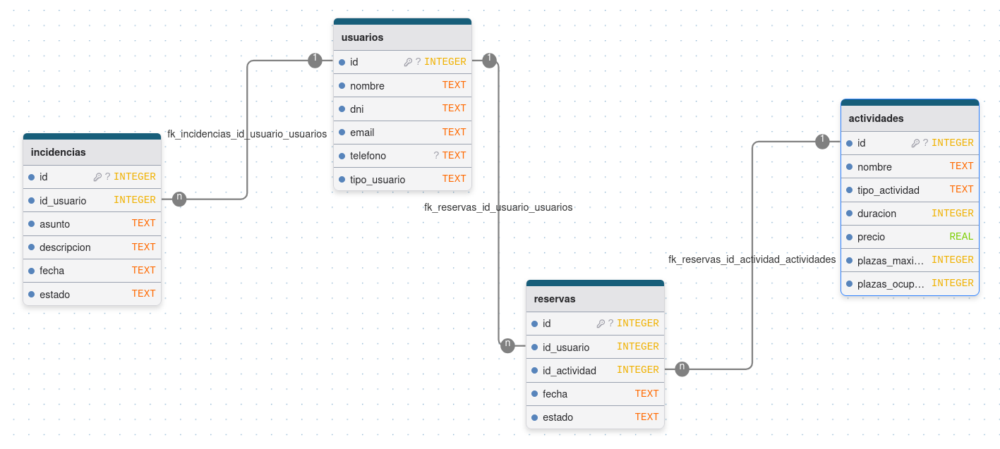

# BASE DE DATOS CENTROPLUS CONNECT

La base de datos del sistema CentroPlus Connect usa SQLite3 que almacena la información principal de la aplicación.

La base de datos contiene las siguientes tablas:

- usuarios
- actividades
- reservas
- incidencias

y sus relaciones son: 

- usuarios 1:N reservas -> un usuario puede tener muchas reservas
- actividades 1:N reservas -> una actividad puede estar asociada a muchas reservas
- usuarios 1:N incidencias -> un usuario puede registrar muchas incidencias.

## DIAGRAMA DE LA BASE DE DATOS

     

## ESTRUCTURA DE CARPETAS

centroplus-connect/
│
├── database/
│   ├── centroplus.db
│   ├── schema.sql
│   └── seed.sql
│
├── images/
│   └── diagrama-bd.png
│
└── README.md

